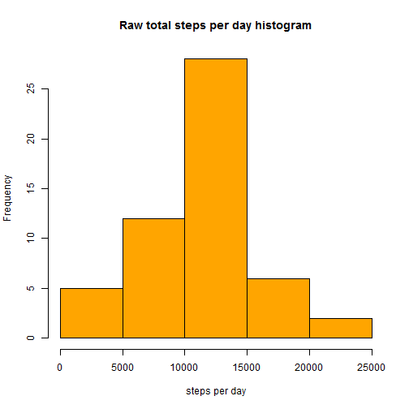
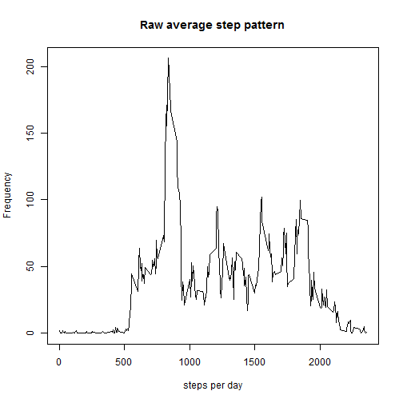
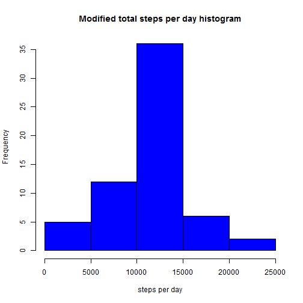

This is a submission for Peer Assessment 1 for Coursera: Reproducible Research.

First some default settings:


```r
library(knitr)
opts_chunk$set(echo=T, results='asis')
```

# Section 1: Reading+Processing the data

Here is the code to read the file and some basic processing for the next couple of sections.


```r
activityData <- read.table("./activity.csv", sep=",", header=TRUE, na.strings = 'NA')
intervals <- unique(activityData$interval)
dates <- unique(activityData$date)

dayActivityData <- split(activityData,activityData$date)
intervalActivityData <- split(activityData,activityData$interval)
```

# Section 2: Basic Stats

Below is the code for the requested plot and calculation of the mean and median.


```r
totalStepsPerDay <- sapply(dayActivityData,function(x) sum(x$steps,na.rm=FALSE))
hist(totalStepsPerDay, 
     main="Raw total steps per day histogram",
     xlab="steps per day",
     ylab="Frequency",
     col="orange")
```

 

```r
meanStepsPerDay <- mean(totalStepsPerDay, na.rm=TRUE)
medianStepsPerDay <- median(totalStepsPerDay, na.rm=TRUE)
```

The mean total steps per day is 1.0766 &times; 10<sup>4</sup> .

The median total steps per day is 10765 .

# Section 3: Average Daily Pattern

The average daily pattern and peak is calculated using the following code:


```r
averageIntervalActivityData <- sapply(intervalActivityData,function(x) mean(x$steps,na.rm=TRUE))
plot(x=intervals,
     y=averageIntervalActivityData,
     main="Raw average step pattern",
     xlab="steps per day",
     ylab="Frequency",
     type="l")
```

 

```r
maxSteps <- max(averageIntervalActivityData)
intervalIndex <- which.max(averageIntervalActivityData)
maxStepsInterval <- intervals[intervalIndex]
```

The peak # of steps is 206.1698.
The peak occurs in the 835 interval.

# Section 4: Input Missing Values

To remove the possible effects of the NA values, a scheme was chosen to replace those blank values.
The scheme chosen was to replace any NA values with the mean steps for that time interval.

The code for doing so is below:


```r
library(data.table)
DT = data.table(steps=activityData$steps,
                date=activityData$date,
                interval=activityData$interval)
# Find all the rows with NA
DT[,need_filler:={
        ifelse(is.na(steps),TRUE,FALSE);
}]
# Calculate all possible replacement values
DT[,meanStepsByInterval:=mean(steps,na.rm=TRUE),by=interval]
# Replace all values on the filler decision variable
DT[,modified_Steps:={
        ifelse(need_filler,meanStepsByInterval,steps);
}]
```

## Section 4.4: Basic Stats of Data with Missing Values

The code to calculate the basic stats similar to section 2 is present here as well as a similar plot.


```r
numOfNAs <- sum(DT$need_filler)
modDayActivityData <- split(DT,DT$date)
modTotalStepsPerDay <- sapply(modDayActivityData, function(x) sum(x$modified_Steps,na.rm=FALSE))
hist(modTotalStepsPerDay, 
     main="Modified total steps per day histogram",
     xlab="steps per day",
     ylab="Frequency",
     col = 'blue')
```

 

```r
modMeanStepsPerDay <- mean(modTotalStepsPerDay, na.rm=FALSE)
modMedianStepsPerDay <- median(modTotalStepsPerDay, na.rm=FALSE)
```

The modified mean total steps per day is 1.0766 &times; 10<sup>4</sup> .

The modified median total steps per day is 1.0766 &times; 10<sup>4</sup> .

# Section 5: Weekdays vs Weekends

Since we are comparing the weekdays to the weekends, a decision variable is now necessary to split the data.

The code for that is below.


```r
DT[, weekday := weekdays(as.Date(date))]
daysRecord <- DT$weekday
weekSection <- sapply(daysRecord, function(x) ifelse(x == "Saturday" || x == "Sunday","Weekend","Weekday") )
weekSectionFactor <- as.factor(weekSection)

DT$weekSection <- weekSectionFactor
weekSectionActivityData <- split(DT,DT$weekSection)
weekendActivityData <- weekSectionActivityData$Weekend
weekdayActivityData <- weekSectionActivityData$Weekday
weekendIntervalActivityData <- split(weekendActivityData,weekendActivityData$interval)
weekdayIntervalActivityData <- split(weekdayActivityData,weekdayActivityData$interval)
weekendAvgIntervalActivityData <- sapply(weekendIntervalActivityData,function(x) mean(x$modified_Steps,na.rm=FALSE))
weekdayAvgIntervalActivityData <- sapply(weekdayIntervalActivityData,function(x) mean(x$modified_Steps,na.rm=FALSE))

plot(x=intervals,
     y=weekendAvgIntervalActivityData,
     main="Modified weekend average step pattern",
     xlab="intervals (5 minutes)",
     ylab="steps",
     type="l")
```

 

```r
plot(x=intervals,
     y=weekdayAvgIntervalActivityData,
     main="Modified weekday average step pattern",
     xlab="intervals (5 minutes)",
     ylab="steps",
     type="l")
```

 

Comparing the two plots, it would appear that the peak number of steps is higher for weekdays.
It is also important to note that weekend activity seems to higher intensity activity throughtout the day.
